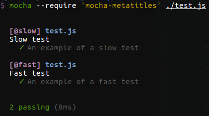
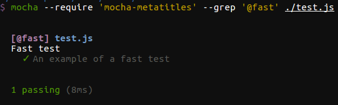

# mocha-metatitles

[](https://travis-ci.org/coditorium/nodejs-mocha-metatitles)
[](http://npm.im/mocha-metatitles)
[](http://npm-stat.com/charts.html?package=mocha-metatitles&from=2015-08-01)

Add metadata to [mocha](https://github.com/mochajs/mocha) test titles.

## Sample usage

Build some test types and make them globally available

```js
const { buildTestType } = require('mocha-metatitles');

global.slowTest = buildTestType('slow');
global.fastTest = buildTestType('fast');
```

Use test types like the [`describe`](https://mochajs.org/#getting-started) function from mocha:

```js
fastTest('Fast test title:', () => {
  it('should work correctly and be fast', () => {
    // empty
  });
}
```

## Features

- Test titles with test type and file path



- Easy [grep](https://mochajs.org/#g---grep-pattern) through test types



- Setup conditional test execution using `options.argv` parameter. See more [options](lib/schema/optionsSchema.json)

```js
const { buildTestType } = require('mocha-metatitles');
const slowTest = buildTestType('slow', { argv: { slowTests: true} });

slowTest('Slow test:', () => {
  it('Runs only on command line parameter slowTests=true', () => {
    // empty
  });
}
```
